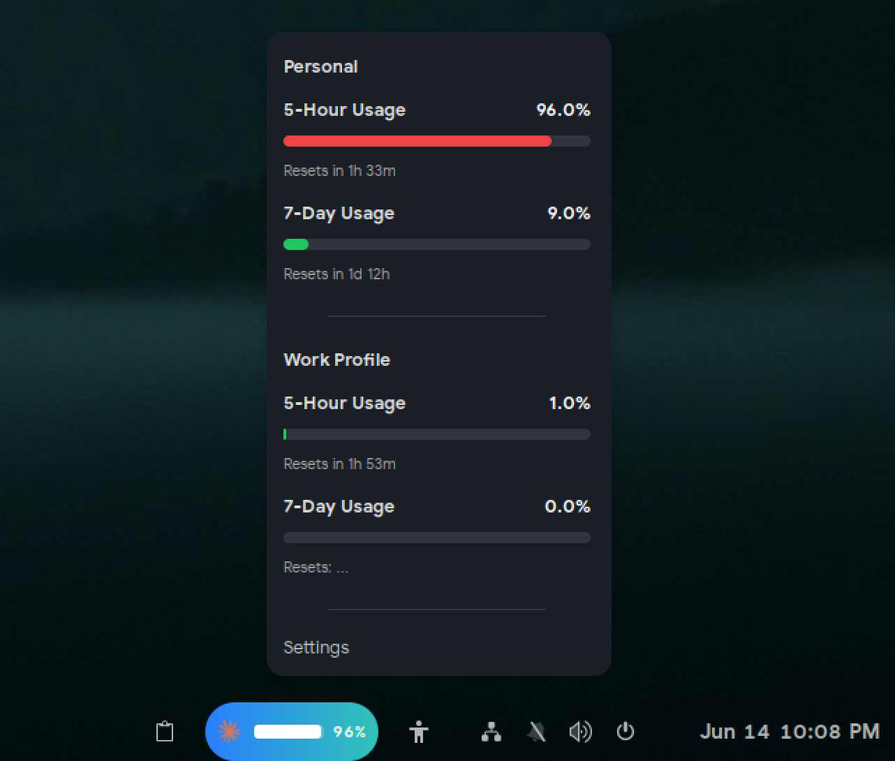

# Claude Code usage extension
   

A GNOME Shell extension that displays your Claude Code API usage percentage in the top panel. 

<div style="text-align: center;">

</div>


## Features

- **Usage monitoring** - View your 5-hour and 7-day Claude Code usage as a percentage and/or progress bar in the top panel.
- **Activity-aware refresh** - Watches your Claude config directory for session activity and refreshes shortly after you stop, so the panel stays current without constant polling. A regular interval acts as a fallback, and requests back off automatically on errors.
- **Multiple profiles** - Track several Claude config directories (e.g. personal and work) at once, each with its own usage, and choose which ones appear in the panel.
- **Idle-aware** - Pauses refreshing while the session is locked and resumes on unlock.
- **Customizable display** - Choose text, progress bar, or both; toggle the icon; pick a color or monochrome icon.
- **Network options** - Optional HTTP proxy support.

## Requirements

- GNOME Shell 46 to 50
- Claude Code installed and authenticated (`~/.claude/.credentials.json`)

## Installation                                                                                                                                                                                                  

### Automatic

The extension is distributed on *extensions.gnome.org* here : [link](https://extensions.gnome.org/extension/9231/claude-code-usage/)


### Manual

```bash
git clone https://github.com/Haletran/claude-usage-extension
cp -r claude-usage-extension ~/.local/share/gnome-shell/extensions/claude-code-usage@haletran.com 
cd ~/.local/share/gnome-shell/extensions/claude-code-usage@haletran.com/schemas                                                                                                                                        
glib-compile-schemas .
## Restart Gnome Shell with Alt + F2 type r or logout
## Then enable the extension
```
